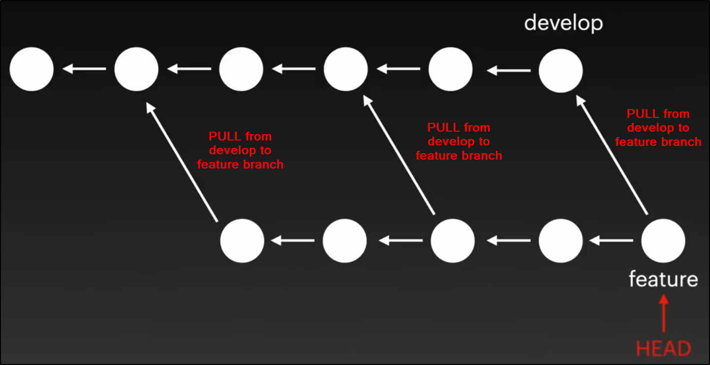
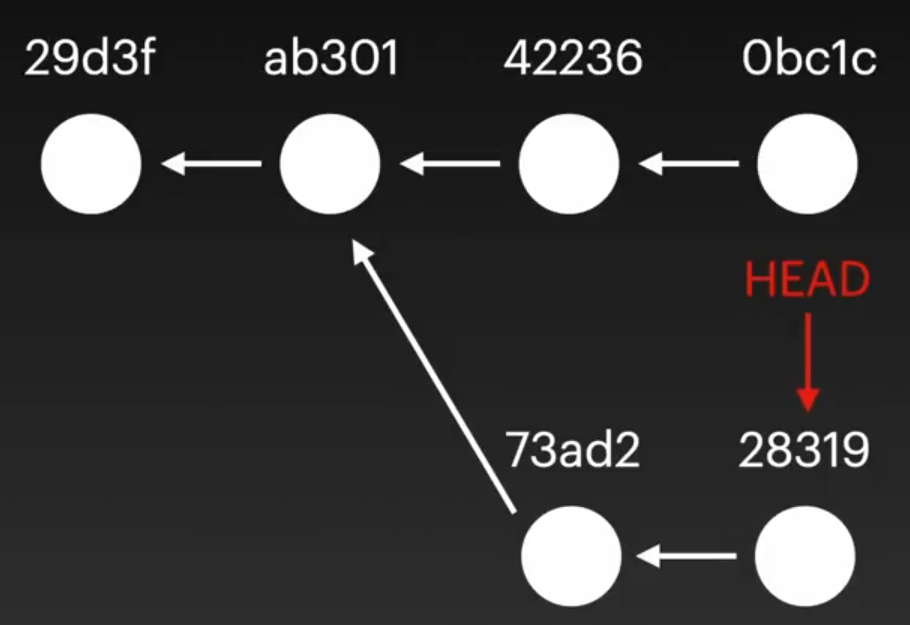

# Configure Git

```bash
git config --global user.name "testUsername"
git config --global user.email "mail@mail.com"

git config -l # shows git configuration

# global means that username and mail will be used for all repos in the computer
```

# Git Adding New Files

**Tracked:** It means that Git's is aware of the particular file, tracks the changes that happen in this file
**Untracked:** The file is in the git's directory but it's not staged which means git's not tracking the changes in the file.

# Commit Directly

When the change is small, you might want to commit the change directly without dealing with the staging. You can do this by using the following code:
```bash
git commit -a -m "git commit message"
```

# Commit History
```bash
git log

commit 6a66de18f7014ac691b71211a4521a44c4e335a3 (HEAD -> main, origin/main)
Author: BooRuleDie <booruledie+github@gmail.com>
Date:   Fri Jul 14 09:58:25 2023 +0300

    README updated

commit 06438fdffa6d7480448456fcf90cae1e846d9e94
Author: BooRuleDie <booruledie+github@gmail.com>
Date:   Fri Jul 14 09:48:49 2023 +0300

    oop5 added

commit a1717540f87951c4707f725f7c5620ecb7c940cf
Author: BooRuleDie <booruledie+github@gmail.com>
Date:   Fri Jul 14 09:34:22 2023 +0300

    oop4 added

commit fea6cdcffb96fbb31039e83def7ac1dbd47e4135
Author: BooRuleDie <booruledie+github@gmail.com>
Date:   Thu Jul 13 12:17:13 2023 +0300

    oop3 added
```

# Git Help

Usage: `git <command> -help`
```bash
git commit -help

usage: git commit [<options>] [--] <pathspec>...

    -q, --quiet           suppress summary after successful commit
    -v, --verbose         show diff in commit message template

Commit message options
    -F, --file <file>     read message from file
    --author <author>     override author for commit
    --date <date>         override date for commit
    -m, --message <message>
                          commit message
    -c, --reedit-message <commit>
                          reuse and edit message from specified commit
    -C, --reuse-message <commit>
                          reuse message from specified commit
    --fixup [(amend|reword):]commit
    ...
```

In order to get all version of the help page you can use `--all` flag.

`git help --all`

# Git Branch

Branches allow you to work with different parts of the application without changing the main application. After you're done you merge these changes to the main application(branch).

You can do whatever you want in newly created branches(Create new files, deleting some files, updating some files ...) and if you get an error you don't have to merge it with the main application its status hasn't changed.

## New Branch
```bash
git branch test-git-branches # new branch created

git branch # show the available branches
* main # indicate the current branch
  test-git-branches

git checkout test-git-branches # switch to newly created branch
```

When you're on this branch if you create a file, add it to the stage, commit it and turn back to main branch; you won't see the file there because all the changes you've made while you're on the newly created branch stay there and don't change anything in other branches as long as you don't merge them.

```bash
git checkout -b emergency-fix # create the branch and switch to it
```

In order to see remote branches you can use the `-r` flag
```bash
git branch -r
* master
  remotes/origin/html-skeleton
  remotes/origin/master
```

# Git Merge

```bash
git merge emergency-fix
```

As you work on another branch, other developers can work on the main branch as well, so if you want to merge the feature branch that you're working on at some point. You need to pull all the changes from the main branch before performing any merge operations.




# Git Remote

```bash
git remote add origin https://github.com/w3schools-test/hello-world.git
git push --set-upstream origin master # now you can just use git push
```

# Git Pull

Git pull is combination of two command:
* fetch
* merge

```bash
git fetch origin # fetches changes from the remote repo
git merge origin master
```

# Git Push

```bash
git push origin master
```

# Github Flow

Flow goes like that:
* Create New Branch
* Make Changes and Add Commits
* Open a Pull Request
* Review
* Deploy
* Merge

# .gitignore Except

```bash
*.log # ignore all log files
!main.log # except main.log
```

# SSH Authentication

1. Create SSH Private and Public Key
```bash
ssh-keygen -t rsa -b 4096 -C "mail@mail.com"
```

2. Copy the Content of Public Key and Paste it into GitHub (SSH and GPG keys)

3. Test Connection
```bash
ssh -T git@github.com

Hi BooRuleDie! You've successfully authenticated, but GitHub does not provide shell access
```

# Switch to Commit

You can see the codebase at a particular time by referencing the commit hash
```bash
git checkout <commit-hash> 

git checkout <branch-name> # turn back where you left off
```

You can see what commit you're on by looking at the **HEAD** pointer. It always shows you where you're currently.
And if you make a commit after the `git checkout <commit-hash>` operation. Git creates another branch for that new commit just like that:


